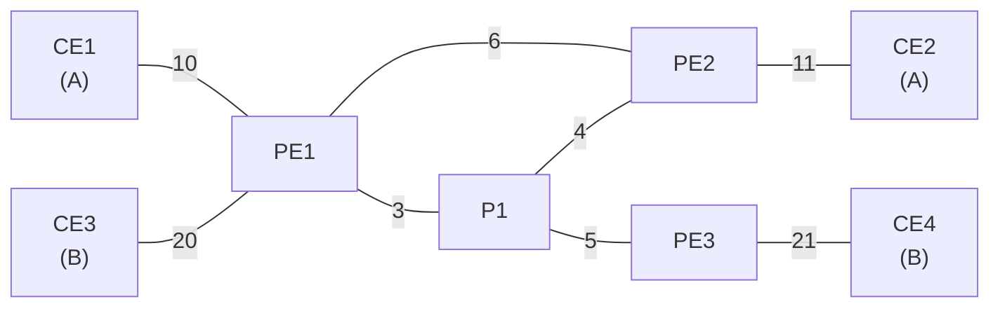

# bgp-frr-srv6

This integration test implements a basic service-provider topology to test IPv6 Segment Routing (SRv6) behavior end-to-end.

The provider network consists of four routers (P1, PE1, PE2, and PE3) and uses only ipv6. Customers A and B are connected to the provider through customer-edge routers: CE1 and CE2 for customer A, and CE3 and CE4 for customer B. In this setup, CE1 and CE3 connect into PE1, while CE2 connects into PE2, and CE4 connects into PE3.

## Addresses

| System | IPv4                    | IPv6                          |
|--------|-------------------------|-------------------------------|
| P1     |                         |                               |
| PE1    |                         | 2001:db8:1::/48 (lo: :ffff::1)|
| PE2    |                         | 2001:db8:2::/48 (lo: :ffff::1)|
| PE3    |                         | 2001:db8:3::/48 (lo: :ffff::1)|
| CE1    | 10.10.1.0/24 (lo: .100) | 3fff:aaaa:1::/48 (lo: ::100)  |
| CE2    | 10.10.2.0/24 (lo: .100) | 3fff:aaaa:2::/48 (lo: ::100)  |
| CE3    | 10.20.1.0/24 (lo: .100) | 3fff:bbbb:1::/48 (lo: ::100)  |
| CE4    | 10.20.2.0/24 (lo: .100) | 3fff:bbbb:2::/48 (lo: ::100)  |

## Software Selection
| System | Network Implementation    | Routing Daemon   |
|--------|---------------------------|------------------|
| P1     | legacy networking options | FRR (isisd)      |
| PE1    | legacy networking options | FRR (isisd,bgpd) |
| PE2    | systemd-network           | FRR (isisd,bgpd)*|
| PE3    | ifstate                   | FRR (isisd,bgpd) |
| CE1    | systemd-network           | FRR (bgpd)       |
| CE2    | legacy networking options | BIRD             |
| CE3    | legacy networking options | FRR (bgpd)       |
| CE4    | ifstate                   | FRR (bgpd)       |

\* GoBGP planned

## Resources
This test was only possible because of these blog posts:
- https://onvox.net/2022/06/27/srv6-frr/
- https://onvox.net/2024/02/01/srv6-vyos/
- https://onvox.net/2024/12/16/srv6-frr/
- https://onvox.net/2024/12/26/srv6-vyos-revisit/
