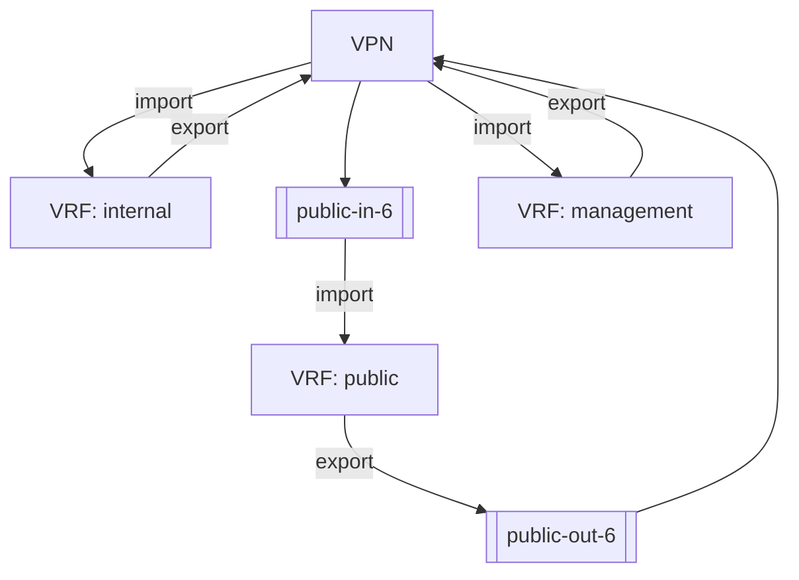

# bgp-frr-vpn-route-leak

This integration test validates route leaking between multiple VRFs using BGP VPN in FRR.

**VRF**:

A Virtual Routing and Forwarding instance isolates routing tables and forwarding decisions.
Here, each VRF has its own route table, while the test selectively allows routes to move
between them via BGP VPN policies.

**BGP VPN**:

The VPN mechanism for route leaking is implemented through MP-BGP inside and across VRFs.
Routes are exported from one VRF and imported into another using Route Targets, allowing
controlled leaks without disabling VRF isolation globally.

**Route Maps**:

Route Maps apply match/set policy to exported and/or imported routes. In this test, vrf
internet imports/exports routes based on the applied route map (public-in/public-out).
While the import route map ensures VRF public contains only routes eligible for the default
free zone, the export route map ensures only the default route is being exported to VPN.

**Route Distinguisher**:

The RD makes routes unique in BGP VPN by combining it with the prefix to form a VPNv4-style identifier.
Even if two VRFs use the same prefix, distinct RDs prevent collisions in the BGP VPN control plane.

In this test the following RD are being used:

| VRF        | Route Distinguisher |
|------------|---------------------|
| Internal   | 64496:10            |
| Public     | 64496:20            |
| Management | 64496:30            |

**Route Targets**:

- Export RT: the Route Targets that will be attached to routes originated/selected in this VRF.
- Import RT: the Route Targets that a VRF accepts from other VRFs.

If a route’s export RT matches a VRF’s import RT, that route is installed into the importing VRF’s routing table—creating the controlled route leak.

The following Route Targets are being used:
Each VRF exports into the exactly one RT, but may import multiple.

| VRF        | Export Route Target | Import Route Target    | Description      |
|------------|---------------------|------------------------|------------------|
| Internal   | 64496:100           | 64496:200 (Public)     | Default Route    |
|            |                     | 64496:300 (Management) | Loopback Address |
| Public     | 64496:200           | 64496:100 (Internal)   | Own Networks     |
| Management | 64496:300           | 64496:100 (Internal)   | Own Networks     |
