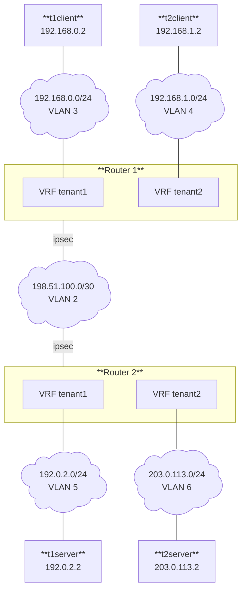

# IPsec XFRM multi tenant VRF

```mermaid
flowchart TD
  subgraph r1["**Router 1**"]
    r1t1vrf["VRF tenant1"]
    r1t2vrf["VRF tenant2"]
  end
  subgraph r2["**Router 2**"]
    r2t1vrf["VRF tenant1"]
    r2t2vrf["VRF tenant2"]
  end

  cloud[198.51.100.0/30
  VLAN 2]@{ shape: cloud }

  r1t1cloud[192.168.0.0/24
  VLAN 3]@{ shape: cloud }
  r1t2cloud[192.168.1.0/24
  VLAN 4]@{ shape: cloud }
  r2t1cloud[192.0.2.0/24
  VLAN 5]@{ shape: cloud }
  r2t2cloud[203.0.113.0/24
  VLAN 6]@{ shape: cloud }

  t1client[**t1client**
  192.168.0.2]
  t2client[**t2client**
  192.168.1.2]
  t1server[**t1server**
  192.0.2.2]
  t2server[**t2server**
  203.0.113.2]

  t1client --- r1t1cloud --- r1t1vrf
  t2client --- r1t2cloud --- r1t2vrf
  r1 -- ipsec --- cloud -- ipsec --- r2
  r2t1vrf --- r2t1cloud --- t1server
  r2t2vrf --- r2t2cloud --- t2server
```
