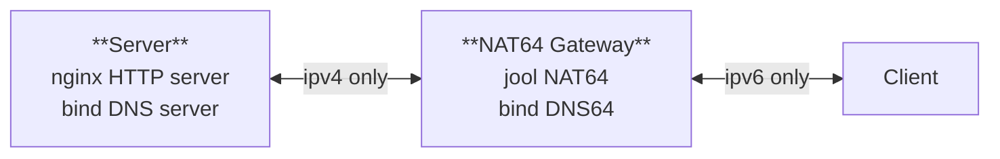

# NAT64 with DNS64

This repository contains a test environment to validate the functionality of a NAT64
gateway with DNS64 support, enabling IPv6-only clients to access IPv4-only servers.

```mermaid
flowchart LR
  server["**Server**
  nginx HTTP server
  bind DNS server"]

  nat64gw["**NAT64 Gateway**
  jool NAT64
  bind DNS64"]

  client[Client]

  server <-- ipv4 only --> nat64gw <-- ipv6 only --> client
```
