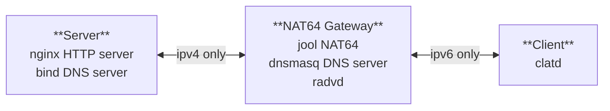

# NAT64 with PREF64

This configuration extends the [nat64-dns64](../nat64-dns64/) test by replacing DNS64
functionality with PREF64. Instead of using a DNS64-enabled DNS server, the NAT64 gateway
now uses radvd (Router Advertisement Daemon) to advertise IPv6 prefixes that embed IPv4 addresses,
allowing the client to generate IPv6 addresses for IPv4 destinations automatically using clatd.

