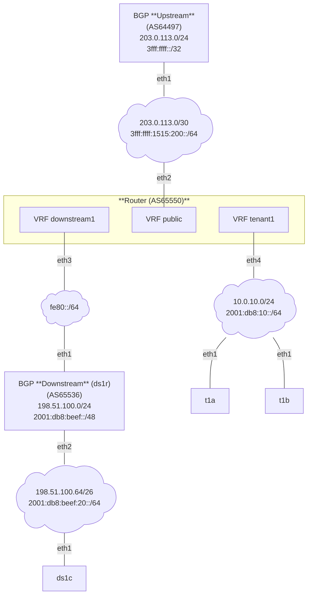

# vrf

This NixOS test implements a multi-tenant routing topology using Linux VRFs and FRRouting (FRR).
Each tenant is isolated in its own VRF, while a shared public VRF provides upstream Internet connectivity.

The test models a small service-provider edge router that:
- Operates its own Autonomous System
- Connects to an upstream provider
- Hosts multiple tenants with independent routing domains
- Supports both BYOIP and provider-assigned address space

The primary goal is to validate VRF isolation, routing correctness, and controlled route leaking.

## Network diagram

Notes:
- The upstream provider supplies a full table to the router.
- The downstream receives a full table (default free zone) for ipv4 and a default originate route for ipv6 (just to cover both cases).
- You delegate tenant1 a ipv6 prefix, ipv4 traffic from rfc1918 source addresses should be natted on your router.

### Resources
| Owner       | Systems    | Resources                                   | Description             |
|-------------|------------|---------------------------------------------|-------------------------|
| ISP         | upstream   | AS64497, 203.0.113.0/24, 3fff:ffff::/32     | transit provider        |
| You         | router     | AS65550, 192.0.2.0/24, 2001:db8::/40        |                         |
| downstream1 | ds1r, ds1c | AS65536, 198.51.100.0/24, 2001:db8:beef:/48 | bgp downstream customer |
| tenant1     | t2a, t2b   |                                             | non bgp customer        |

## Design
Each VRF has:
- Its own routing table
- Independent BGP address families
- No implicit route leakage

### Routing Model
#### Public VRF
- Establishes eBGP sessions with upstream providers
- Serves as the shared exit point for all traffic

#### Tenant VRFs
- Maintain strict L3 isolation
- May run BGP (Downstream 1) or static routing (Tenant 1)
- Use explicit route leaking to access the public VRF

#### Route Leaking
- Route leaking is intentionally explicit and directional:
  - Downstream VRFs (RD: `65550:20`, RT: `65550:1020`) may import routes from the public VRF (RD: `65550:10`, RT: `65550:1010`)
  - Tenant routes are not visible to other tenants
  - No transitive leakage between tenant VRFs

## TODO
- NAT for Tenant1 is being applied after VRF public (on eth2), this results in wrong dest address for reply. Is it possible to move NAT between VRF tenant1/public?
- ds1r has ra default ipv6 routes, besides bird??? -> remove these!
- Think about how to add default route in vrf tenant1, currently via main
  > staticd[697]: [PNYPZ-BCP8Y] Static Route using public interface not installed because the interface does not exist in specified vrf

### Extend (beyond first idea)
- test default originate from upstream provider when route leaking is setup within frr (linux ip rule doesn't support this)
